# AutoDock Tutorial
**Version 1.0 - February, 2026. Monterrey**

**Authors:** 
[Ana C. Murrieta ](https://orcid.org/0000-0002-7619-8880) and [Flavio F. Contreras-Torres](https://orcid.org/0000-0003-2375-131X). Tecnológico de Monterrey.


[](LICENSE)
[](https://creativecommons.org/licenses/by/4.0/)

[]()


---

# INTRO
This notebook is a hands-on introduction to molecular docking using [AutoDock Vina](https://autodock-vina.readthedocs.io/en/latest/) and to the essential concepts required to perform a basic docking workflow. It is intended for beginners as well as for learners with prior experience who wish to strengthen their understanding of ligand–receptor docking, structure preparation, docking setup, and interpretation of computational results.

The notebook is divided into three main parts:

- **Part 1: Introduction to Molecular Docking.** You will become familiar with the basic principles of molecular docking, the general purpose of AutoDock, and the role of docking in the computational analysis of ligand–receptor interactions.

- **Part 2: Protocol.** You will learn the main steps of a typical docking workflow, including the selection of receptor and ligand structures, preparation of input files, definition of docking parameters, execution of docking calculations, and initial analysis of the results.

- **Part 3: Results Interpretation and Practice.** You will learn how to examine predicted binding poses, evaluate docking outputs, identify common issues, and reinforce the workflow through guided practice.

<br>

### Sources and Learning Materials

This tutorial is not meant to be the first or the last resource you will use to learn **AutoDock Vina** and molecular docking. Instead, it is a curated learning path built from several tutorials, lecture notes, exercises, and official documentation.

Many of the ideas, examples, and exercises presented here are inspired by or adapted from existing educational materials, including the official documentation and common teaching resources used in courses and online tutorials. For this reason, you may notice that some exercises or examples look similar to ones you have seen elsewhere. This is intentional: these problems are standard, well-tested ways of learning core concepts.

The goal of this tutorial is not to present completely new material, but to organize and connect these concepts in a coherent, progressive way, with explanations, practice exercises, testing, and debugging techniques all in one place.

You are encouraged to complement this tutorial with other resources, such as:

- The official [AutoDock Vina documentation](https://autodock-vina.readthedocs.io/)
- Free course notes, books, and lecture materials [Vina manual](https://vina.scripps.edu/), [AutoDock Vina repository](https://github.com/ccsb-scripps/AutoDock-Vina/), [Protocols](https://pmc.ncbi.nlm.nih.gov/articles/PMC4669947/), etc.
- Online tutorials [jRicciL](https://jriccil.github.io/Taller_Simulacion_Molecular/docking_con_adt4.html)

Learning works best when you see the **same ideas explained in multiple ways and from multiple sources**.


<br>

# PART 1. Introduction to Molecular Docking

**Molecular docking** is a core method in structure-based drug design (SBDD) for predicting, with a substantial degree of accuracy, the binding pose of small molecules in the active site of a receptor [[1]](https://doi.org/10.1016/j.rechem.2024.101319). It compromises several computational approaches with the goal to fit ligands into multiple receptor states (e.g., active/inactive, co-activator–bound, mutants), to **predict binding poses** and to **estimate affinity** (i.e., binding affinity). Docking returns a ranked list of compounds and highlights key interactions (e.g., anchor residues, H-bonds, π–π, hydrophobic contacts), supporting *binding-mode hypotheses* and ligand prioritization. 

Results depend on approximations—software [[2]](https://www.eurekaselect.com/article/51070) (e.g., AutoDock Vina, Qvina, MOE, Glide, etc.), parameters (e.g., search box, exhaustiveness, number of poses), and the **scoring function** (e.g., the AutoDock Vina empirical score, MOE's London dG scoring function, and others). Robustness improves when using ensembles of receptor structures (i.e., multiple PDB entries, states, or mutants) and verifying that top best-scoring ligands from each docking run can be pooled and de-duplicated. 

Molecular docking and **virtual screening** are related but differ in scope and purpose. Docking typically refers to evaluating one (or a small set of) ligand–receptor pairs to predict binding pose(s), estimate affinity, and rationalize key contacts. Virtual screening [[3]](https://www.tandfonline.com/doi/full/10.1517/17460441.2010.484460) applies docking (and often other filters) **at scale** to large libraries, ranking compounds to prioritize a small subset for experimental testing. In practice, docking is the *engine* that generates poses and scores; virtual screening is the *workflow* that uses that engine repeatedly—adding library preparation, property/PAINS filters, rescoring or consensus scoring, and enrichment/hit-rate assessment—to identify novel chemotypes.

This is a self-authored tutorial for performing docking calculations with [AutoDock Vina](https://vina.scripps.edu/). The AutoDock Suite is a free, open–source software for the computational docking and virtual screening of small molecules against macromolecular receptors, developed at the Center for Computational Structural Biology [(CCSB)](https://ccsb.scripps.edu/), La Jolla, CA, USA. The suite currently includes complementary tools such as *AutoDock (AD4)*, *AutoDock Vina*, *Raccoon2*, *AutoDockTools*, and *AutoLigand*. The software has been implemented, calibrated, and tested on diverse protein–ligand complexes of biological and medicinal interest. For a comprehensive, step-by-step workflow, see the seminal article [[4]](https://doi.org/10.1038/nprot.2016.051) at Nature Protocols journal.

Before we continue, a brief note on the differences between **AutoDock (AD4)** and **AutoDock Vina**:

- **Scoring**  
  - **AD4:** Empirical free-energy force field (vdW, electrostatics, H-bond, desolvation) + torsional penalty. 
  - **Vina:** Compact empirical score function (gaussians + repulsion + hydrophobic + H-bond). 
  - *Do not compare scores across engines—only within the same engine/config.*    

- **Search**  
  - **AD4:** Lamarckian genetic algorithm (LGA) with Solis–Wets local search; tuned via `ga_run`, `ga_pop_size`, `ga_num_evals`, etc.
  - **Vina:** Stochastic global search with rapid, gradient-based local optimization (BFGS-like); tuned via `--exhaustiveness`, `--num_modes`, `--energy_range`, `--seed`.  

- **Setup**  
  - **AD4:** Requires **AutoGrid** (precomputed affinity maps; AD4 atom types).
  - **Vina:** Builds the grid internally from **PDBQT** (no AutoGrid step).  

- **Performance / Use**  
  - **AD4:** More configurable; provides per-term energy components.
  - **Vina:** Typically faster and multithreaded—good for large screens.


Use **AD4** when you need term-level energy decomposition or to reproduce legacy protocols; use **Vina/QVina** for streamlined, high-throughput docking. In both cases validate the protocol by re-docking ligands into cognate co-crystal structures of **comparable conformational complexity**.


This tutorial focuses on **AutoDock Vina** and related utilities; please ensure they are pre-instaled on your system: 

- **Python** - Scripting and process automatization
- **Bash** - Shell scripting for automatization of repetitive tasks
- **[Open Babel](https://github.com/openbabel/openbabel)** - Conversion between molecular structure formats and ligand preparation
- **[Meeko](https://github.com/forlilab/Meeko)** - Preparing input files for molecular docking
- **[PyMOL](https://pymol.org/)** - Graphic visualization of molecular structures and docking results
- **[RDKit](https://www.rdkit.org/)** - Cheminformatics toolkit for ligand preparation and analysis 
- **[ChimeraX](https://www.cgl.ucsf.edu/chimerax/)** - Molecular visualization and docking preparation
- **[MODELLER](https://salilab.org/modeller/)** - Homology modeling of the protein structures
- **[AutoDock Vina](https://vina.scripps.edu/)** — Molecular docking engine 
- **[Qvina](https://qvina.github.io/)** - Molecular docking engine (AutoDock Vina derivative)
- **[CavityPlus](http://www.pkumdl.cn:8000/cavityplus/#/)** - Identification of binding pockets and cavities 
- **[LigPlot+](https://www.ebi.ac.uk/thornton-srv/software/LigPlus/download.html)** - Visualization of protein-ligand interactions


To set up the workspace, create a dedicated Python environment named **`bio_env`**

```bash
conda create -n bio_env python=3.10
```
<br>


This environment will house MODELLER, Meeko, and all other dependencies required to run the **notebooks**.


> **Note:**  
> The instructions in this tutorial are designed for an environment running **Ubuntu 22.04.4 LTS** with **Python 3.10.**

<br>


# PART 2. Protocol
 
The docking workflow implemented in this tutorial comprises four main stages:

- **Selection of Structures**
- **Preparation of Structures**
- **Docking Setup and Execution**
- **Analysis of Results**


Although each stage contributes critically to the overall reliability of the study, the selection of appropriate structural inputs and methodological parameters is particularly important, as these choices directly condition the interpretability and robustness of the docking results. In this tutorial, each stage will be illustrated using a representative case study consisting of the receptor **peroxisome proliferator-activated receptor gamma (PPAR-γ)** and the ligand **rosiglitazone (RGZ)**.


<br>

## 2.1 Selection of Structures 

The first stage of any docking study is the selection of molecular structures that are mechanistically consistent with the biological question under investigation. This decision must be guided by the functional state of the receptor, the binding mode to be examined, and the level of experimental support available for the ligand of interest. Structural selection is therefore not a preliminary administrative step, but a central component of methodological design, since the validity of the docking experiment depends directly on the relevance of the receptor–ligand system chosen as input.

In the present tutorial, the system of interest is **peroxisome proliferator-activated receptor gamma (PPAR-γ)**, and the objective is to examine ligand recognition in the context of **agonist binding**. Because receptor conformation is strongly coupled to functional state, the structure selected for docking must correspond to an experimentally resolved **active-like conformation** compatible with agonist accommodation in the ligand-binding domain. Likewise, the reference ligand should not be chosen arbitrarily, but on the basis of prior experimental evidence supporting its classification as a **PPAR-γ agonist**.

Accordingly, the structural inputs used in this tutorial are selected from publicly available and experimentally curated sources. The receptor structure is obtained from the **Protein Data Bank (PDB)**, whereas ligand identity and activity annotation can be supported by curated bioactivity resources such as **ChEMBL**, which compile experimental measurements reported in the pharmacological and medicinal chemistry literature. Within this framework, the receptor **PPAR-γ** and the ligand **RGZ** constitute an appropriate model system for illustrating the subsequent stages of docking preparation, execution, and interpretation.


<br>

### Selection of the Receptor

Receptor selection should be based, whenever possible, on **experimentally determined structural data** deposited in curated repositories such as the Protein Data Bank [(PDB)](https://www.rcsb.org/). The use of an experimentally resolved structure provides a direct structural framework for docking and allows the receptor to be evaluated in terms of conformational state, completeness, resolution, and relevance to the binding event under study.

The identification of an appropriate receptor entry requires a systematic inspection of the available PDB records associated with the target protein. Search results can be refined according to criteria such as **organism**, **experimental method**, **resolution**, **release date**, and the presence of relevant bound ligands or associated biomolecular partners. These filters are useful for reducing the dataset to structures that are both biologically pertinent and technically suitable for docking-oriented preparation.

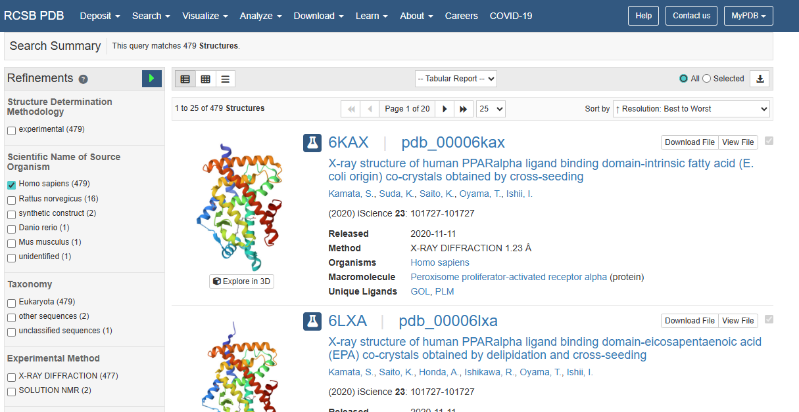{ width=75% }


In the present example, the search was restricted to **human PPAR-γ** structures and the resulting entries were examined in light of both **structural quality** and **functional relevance**. This initial query yielded approximately **480** records, which must then be inspected individually rather than accepted uncritically. Particular attention is required because database searches frequently recover structures corresponding to **co-activator complexes**, **nucleic-acid-associated assemblies**, engineered constructs, or other multimolecular systems that do not necessarily represent the receptor state intended for docking. Receptor selection must therefore be based on the specific biological question, ensuring that the chosen structure corresponds to an appropriate conformational and functional context for ligand binding analysis.

> **Note:**  
> - The PDB is a public repository that currently hosts over **240,000** three-dimensional structures of biomolecules from a wide range of organisms.
> - In cases where no experimentally resolved structures are available in the PDB (e.g., X-ray, cryo-EM, or NMR), alternative approaches such as homology modeling or computational prediction (e.g., AlphaFold) must be employed. These procedures, however, fall outside the scope of this tutorial.

<br>

Once a suitable entry is identified, open its record and examine the metadata. You should verify:

- **Authors** and **submission/release dates** 
- **Structure quality** (method, resolution, refinement statistics)
- **Co-crystallized molecules** (ligands, cofactors, stabilizers, ions)
- **Primary citation** (original article)
- **Functional conformation** (e.g., active vs. inactive) and binding state
- **Sequence features** (mutations, deletions, missing loops)
- **Geometry/validation** (e.g., acceptable Ramachandran statistics)


For this tutorial, we will use a **PPAR-γ** structure in its **active conformation** with the PDB entry [5YCP](https://www.rcsb.org/structure/5YCP). 

On the entry page, select **`Download Files`** → **`Legacy PDB Format`**. Then, download the **`*.pdb`** structure from the PDB. Save the file to your working directory; in this tutorial, it is called **`5YCP.pdb`** (keep it as the raw reference). Such a file contains the 3D coordinates of the protein, co-crystallized ligands (e.g., small organic molecules), co-activators (e.g., peptides), and other heteroatoms (e.g., ions, solvent).


> **Note:**  
> - Although **PDBx/mmCIF** is the modern, preferred format, many downstream tools in docking pipelines still expect **Legacy PDB**. We use **`5YCP.pdb`** here for compatibility, and we will convert or clean it in later steps as needed.  
> - We recommend consulting the original publication associated with the selected **PDB entry** to verify that the system is appropriate and to review the reported structural details, including the interactions with co-crystallized ligand(s).


<br>

### Selection of the Ligand

Here we will work with a single ligand. First, we need to obtain its 3D structure. There are several common molecular representations—**SMILES**, **InChI**, **SDF** (Structure Data File), **PDB**, **MOL2**, etc. You may use whichever format best fits your workflow; however, for molecular docking, starting from an **`*.sdf`** file is often more reliable and tends to introduce fewer errors.

A practical way to retrieve curated **`*.sdf`** files is through [PubChem](https://pubchem.ncbi.nlm.nih.gov), which is a large public database containing information on **over 100 million** chemical substances, typically including structural data, physicochemical properties, vendor information, bioassay results, and more.

We can search **PubChem** using the common name of the compound, such as **rosiglitazone** (**RGZ**), and then carefully select the corresponding entry. In this case, the entry for **RGZ** is **[PubChem CID 77999](https://pubchem.ncbi.nlm.nih.gov/compound/77999)**. Navigate to the **Structure** section and locate the adequate **`3D Conformer`** section → **`DOWNLOAD COORDINATES`**. Then, save the **`*.sdf`** file in your working directory. For this tutorial, it was called **`rgz.sdf`**.


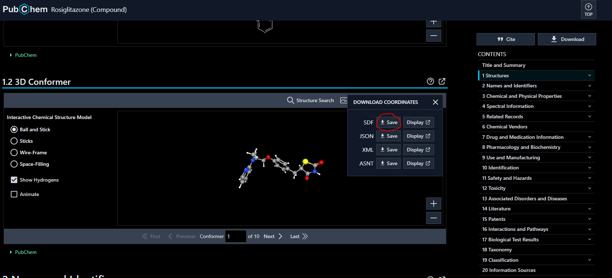{ width=75% }


> **Note:**  
> - In this example, we will manually search for the structure of **RGZ**. For cases involving a large list of ligands, you can use the **PubChem API** to build a Python script that automatically fetches SDF files and associated metadata.
> - To verify correct atomic connectivity for the **`rgz.sdf`** file, we use a graphical viewer such as **PyMOL** or **UCSF Chimera**. 
> - For highly flexible molecules, a **3D** conformer may not be available in PubChem; in that case, use the **2D** record instead.


<br>

## 2.2 Preparation of Structures

Once the raw structural files have been selected, they must be converted into a chemically and structurally consistent representation suitable for docking. This preparation stage involves generating the appropriate file format, removing non-essential structural components, and ensuring that the receptor and ligand are correctly defined for subsequent docking calculations.


### 2.2.1 Ligand Preparation for Docking

Ligand preparation is the foundational process of generating input files for molecular docking calculations and virtual screening campaigns. AutoDock Vina requires these input files to be provided in the **PDBQT format**, and this can be achieved through two primary methodologies.

The first, and more traditional path, involves obtaining a pre-generated 3D structure in **SDF format** (**`*.sdf`**) from a repository like PubChem. This structure is then processed using **Open Babel** to convert it to a **PDB** file (**`*.pdb`**) while defining the protonation state at a target pH (e.g., 7.4). This intermediate file is subsequently subjected to energy minimization using `obminimize` to relax its geometry. Finally, the minimized structure is converted to the final **PDBQT** (**`*.pdbqt`**) file, ready for docking.

The second path utilizes a **SMILES string** to computationally generate a 3D conformer. This conformer, saved as an SDF file, is then directly transformed into the **PDBQT** format using **Meeko**. Unlike the Open Babel route, Meeko focuses on accurate parametrization and the preservation of molecular topology (bond orders) by embedding SMILES metadata directly into the output file, ensuring the molecule is correctly perceived by downstream analysis tools.


**Open Babel Workflow**   

This workflow requires [Open Babel](https://openbabel.org), which should be installed in a dedicated Python environment (i.e., **`*bio_env`**). First, activate the environment from the terminal:

```bash  
conda activate bio_env
```
<br>


#### Conversion to PDB.

Second, we use the comand `babel` to convert the **SDF** file to **PDB**, ensuring that all hydrogen atoms are added to satisfy valences:

```bash  
babel rgz.sdf -opdb -O rgz.pdb -h
```

<br>

> **Note:**  
> It is a best practice to visually inspect the output `.pdb` file in a molecular viewer to confirm that the connectivity and protonation states are correct. Tools like [PyMOL](https://pymol.org/) are ideal for this verification step.


<br>

#### Protonation.

To ensure the simulation reflects physiological conditions, the conversion from **SDF** to **PDB** must account for the ionization states of the functional groups. Instead of simply adding neutral hydrogens, we use the `-p` flag to adjust the protonation state to a specific pH (typically **7.4**).


```bash
babel rgz.sdf -opdb -O rgz.pdb -p 7.4
```

<br>

Using `-p 7.4` is superior to the standard `-h` flag because it uses $pK_a$ models to determine if groups like amines should be protonated (positively charged) or carboxylic acids should be deprotonated (negatively charged). Since the receptor has already been prepared at pH 7.4, this ensures **electrostatic complementarity** between the ligand and the protein binding site.

<br>

#### Energy Minimization.

Once the structure is verified, use `obminimize` to perform an energy minimization. While Open Babel supports several force fields (GAFF, MMFF94, MMFF94S, Ghemical, and UFF), MMFF94 or GAFF typically yield the most reliable results for small organic molecules.

For flexible molecules, we recommend a high number of steps (e.g., 20,000) to ensure the structure reaches a local minimum:

```bash
obminimize -n 20000 -ff MMFF94 rgz.pdb > rgz_min.pdb
```

<br>

Again, we should visually inspect the output to ensure the structure has the correct connectivity and valences.

<br>

#### Generation of the PDBQT file.

The final step is converting the minimized structure into the `.pdbqt` format required by AutoDock Vina:

```bash  
babel rgz_min.pdb -opdbqt -O rgz.pdbqt
```

<br>

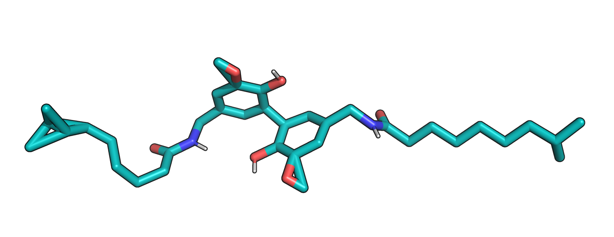{ width=60% }

<br>

#### Atom Count Reduction in PDBQT Conversion.

When converting the ligand structure from PDB to PDBQT, it is normal and expected to observe a decrease in the total atom count. This happens because Open Babel automatically applies the **United-Atom model** during PDBQT generation for AutoDock. 

In this process:  

- **Non-polar hydrogens** (those bonded to carbon atoms) are **removed as explicit atoms**
- Their partial charges and volumes are mathematically **merged into the parent heavy atom**
- **Polar hydrogens** (those attached to heteroatoms like oxygen, nitrogen, or sulfur) are **preserved as explicit atoms**, as they are essential for calculating hydrogen bond interactions during docking

For example, the reduction from **24 to 17 atoms** confirms that the non-polar hydrogens have been merged, leaving a streamlined structure optimized for the AutoDock Vina scoring function. This significantly improves computational efficiency without losing critical chemical information required for accurate docking.

According to AutoDock documentation, the PDBQT format requires that nonpolar hydrogens be removed and their charges fused to the carbons. Open Babel automatically implements this specification when writing PDBQT files without the `-h flag`.

<br>

#### Understanding the PDBQT format.

In a standard [PDBQT file](https://userguide.mdanalysis.org), the structure follows a United-Atom model, meaning that:

- Polar Hydrogens: (Attached to O, N, or S) remain **explicit** as they are essential for calculating hydrogen bonds.
- Non-Polar Hydrogens: (Attached to C) are merged into the heavy atom. They become typically **implicit**, and their partial charges are added to the carbon atom they were attached to.


Since some molecular viewers may not render PDBQT files correctly (often missing bonds or failing to show implicit atoms), you can use the following Python script to inspect the atomic content and charges of your final file:


```bash  
from pathlib import Path

# Adjust this path to match your ligand's PDBQT file location
pdbqt_path = Path(r"C:\..\..\docking\sdf\my_example.pdbqt")

atom_lines = []
hydrogen_lines = []

with open(pdbqt_path, "r", encoding="utf-8") as fh:
    for line in fh:
        if line.startswith(("ATOM", "HETATM")):
            atom_lines.append(line.rstrip())
            atom_name = line[12:16].strip()
            # PDBQT may store element in columns 77-78
            atom_type = line[76:77].strip() if len(line) >= 78 else ""
            if atom_name.startswith("H") or atom_type == "H" or atom_type == "HD":
                hydrogen_lines.append(line.rstrip())

print(f"Total ATOM/HETATM lines: {len(atom_lines)}")
print(f"Explicit hydrogen atoms: {len(hydrogen_lines)}")

print("\nFirst ATOM/HETATM records:")
for line in atom_lines[:10]:
    print(line)

if hydrogen_lines:
  print("\nExplicit hydrogen records (polar hydrogens only):")
  for line in hydrogen_lines:
    print(line)
else:
  print("\nNo explicit hydrogen records found (non-polar hydrogens are implicit).")

```

<br>

#### Troubleshooting Connectivity Issues.

It is critical to visually inspect the files at each stage. Occasionally, you may encounter connectivity distortions, such as atoms being pulled too far apart or bonds overlapping unnaturally.

If the structure appears warped (as seen in the Figure 3), the docking simulation will fail or produce biologically irrelevant results. This is usually caused by:

- Force Field Incompatibility: The chosen force field might not have the proper parameters for a specific functional group in your ligand.
- Conversion Artifacts: Errors during the translation from the 2D spatial data of an SDF to a 3D PDB.

If changing the force field (e.g., from `MMFF94` to `GAFF`) does not resolve the distortion, you can use the `-gen3d flag`. This command tells Open Babel to generate fresh 3D coordinates, perform a quick internal conformer search, and set up the correct geometry before the formal minimization begins:

```bash  
obminimize -n 20000 -gen3d -ff MMFF94 rgz.pdb > rgz_min.pdb
```

<br>


**Advanced Ligand Preparation using Meeko**    

[Meeko](https://github.com/forlilab/Meeko) utilizes the **RDKit** chemical perception engine to automate ligand parametrization for AutoDock Vina. This workflow generates PDBQT files directly from 3D SDF inputs, thereby omitting the requirement for an intermediate PDB format.

```bash  
mk_prepare_ligand.py -i rgz.sdf -o rgz_meeko.pdbqt
```

<br> 

Its implementation introduces two fundamental shifts in ligand preparation:

#### Pre-Processing Requirements.

Meeko is strictly a **parametrization tool**, not a modeling engine. Unlike the Open Babel route demonstrated earlier, it does not perform energy minimization or dynamic reprotonation. It operates under the assumption that the input SDF already contains:

- **A realistic 3D conformation:** The geometry must be pre-optimized (e.g., via `obminimize` or sourced from a 3D-refined database like PubChem).
- **The correct protonation state:** The user must ensure the input reflects the desired ionization for physiological pH (7.4), as Meeko will perceive and preserve the explicit hydrogens provided without performing further $pK_a$ adjustments.

<br>

#### Preservation of Molecular Topology.  

The direct SDF-to-PDBQT route preserves molecular topology, including bond orders and connectivity, which are not explicitly defined in the standard PDB format. The script also identifies rotatable bonds, merges non-polar hydrogens (United-Atom model), and assigns atom types compatible with the AutoDock Vina force field. To prevent information loss, Meeko embeds a "topology map" within the `REMARK` lines of the PDBQT file, including:

- **SMILES string:** The canonical representation of the original molecule.
- **Index mapping:** A dictionary relating PDBQT atoms back to the SMILES string.


Furthermore, Meeko embeds metadata—such as SMILES strings and atom index maps—within the REMARK lines of the resulting PDBQT file. This technical feature enables the reconstruction of docking poses back into RDKit molecules, ensuring data consistency for downstream chemical analysis. This allows for seamless **interoperability**; after docking, tools like RDKit can reconstruct the poses with their original bond orders, making results significantly more reliable for virtual screening analysis.

<br>

#### Implications:

- **High Fidelity:** Avoids errors in bond order inference during post-docking analysis by using embedded metadata.
- **Accurate Atom Typing:** Leveraging RDKit for chemical perception, Meeko provides superior atom-typing (e.g., correctly assigning aromatic sulfur as `SA` rather than a generic `S` atom) compared to more generic conversion tools.
- **Traceability:** The embedded SMILES string allows for the unambiguous identification of the chemical entity corresponding to a docking pose.


> **Note:** 
> Meeko ensures that the molecule you analyze *after* docking is chemically identical to the one you started with, provided you take responsibility for the initial 3D geometry and protonation.

<br>


However, Meeko is best suited for processing **SMILES** (Simplified Molecular Input Line Entry Specification) strings retrieved from reliable chemical databases such as [PubChem](https://pubchem.ncbi.nlm.nih.gov/) or [DrugBank](https://www.drugbank.ca/). For virtual screening campaigns, ligands can be prepared in batch mode using a **`.smi`** file, which contains one or more SMILES strings representing chemical structures. These lists are typically obtained by searching repositories for specific criteria—such as pharmacological activity, molecular weight, or chemical similarity—and exporting the results as a text file.

The preparation process begins by converting the SMILES list into a multi-molecule 3D SDF file using the following command:

```bash
scrub.py $smi_file -o mols.sdf
```

This script can be configured with options to control the generation of isomers—including tautomers and acid/base conjugates—and the number of conformers per entry. At the end of the execution, the standard output reports the total number of isomers successfully written to the multi-molecule SDF file.

To generate the final docking files, process the `mols.sdf` file using `mk_prepare_ligand.py` with the `--multimol_prefix` flag:

```bash
mk_prepare_ligand.py -i mols.sdf --multimol_prefix mols_pdbqt
```

<br>

The `--multimol_prefix` option directs the software to create a specific directory (in this case, mols_pdbqt) to store the individual PDBQT files for each ligand, ensuring an organized workspace for the subsequent docking simulation.


In **Section 3**, we will describe a complete workflow for ligand preparation using [LigandHub](https://nanobiostructuresrg.github.io/LigandHub/), which provides a user-friendly interface for retrieving, curating, and preparing ligands for docking and virtual screening. 


<br>

### 2.2.2 Preparing the Receptor Structure

In **PyMOL**, open the downloaded **`5YCP.pdb`** file from PDB. In some cases, you can notice the file must include an incomplete protein structure, the co-crystallized ligand, and other heteroatoms such as ions and solvent. The goal is to produce one files with **only the receptor**. Furthermore, we will prepare another file with **the crystallized agonist**.

Select the relevant receptor chain (e.g., Chain **A**) and remove everything else. Save the result as **`5YCP_receptor.pdb`**. 


```bash
PyMOL > select chain B
PyMOL > remove sele
PyMOL > select HOH
PyMOL > remove sele
```
<br>

Then isolate the ligand (**RGA**, **BRL**, etc) and save it as **`5YCP_ligand.pdb`**.

If the receptor structure contains **unresolved residues or atoms** that could not be modeled from the experimental electron density, the missing region can be reconstructed by **comparative modeling** using the canonical protein sequence as reference. The first step is therefore to retrieve the canonical sequence from the [UniProt](https://www.uniprot.org/) database.


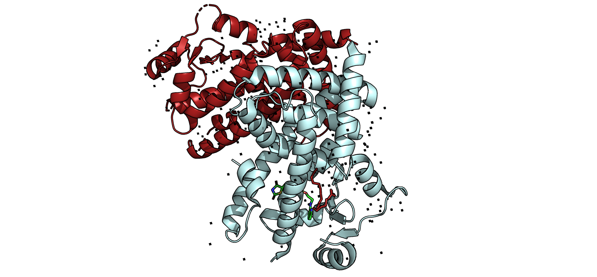{ width=60% }

<br>

For the present example, the relevant entry corresponds to human PPAR-γ **[P37231-2](https://www.uniprot.org/uniprotkb/P37231/entry)**, from which the canonical sequence is obtained for downstream modeling. 

The canonical sequence is used together with the experimentally resolved receptor fragment to generate the **PIR (`*.ali`) alignment file** required by **MODELLER**. In this tutorial, the alignment may be prepared either programmatically, as shown in **Notebook: Receptor Reconstruction**, or interactively using [UCSF ChimeraX](https://www.cgl.ucsf.edu/chimerax/), which allows the canonical sequence and the experimental receptor fragment to be opened, aligned, and exported in a format suitable for comparative modeling. In both cases, the purpose is to define the explicit residue correspondence between the template structure and the target sequence prior to model building.


> **Note:**  
> - [UniProt](https://www.uniprot.org/) is a public database that hosts **over 250 million protein records**. 


<br>

### 2.2.3 Aligning the Canonical Sequence to the Crystal Template

When the crystallographic receptor structure is incomplete due to unresolved residues or atoms, reconstruction of the missing region requires the establishment of an explicit correspondence between the experimentally resolved template and the full biological reference sequence. This is achieved through **comparative modeling** with **MODELLER**, using the **cleaned crystal structure** as the structural template and the **canonical UniProt sequence** as the target. 

The alignment step is therefore a prerequisite for model generation, since it defines which residues are already supported by experimental structural data and which segments must be inferred during reconstruction. In practical terms, this template–target alignment provides the formal basis for rebuilding unresolved regions while preserving the experimentally determined fold of the receptor.

**Alignment file (`.ali`, PIR format).**  

The template–target correspondence required for comparative modeling is encoded in an **alignment file in PIR format**. In the present example, this file is represented by **`seq_5YCP.ali`** in the `docking/` directory and contains two entries: a **template** corresponding to the experimentally resolved receptor structure derived from **`5YCP.pdb`**, and a **target** corresponding to the **canonical human PPAR-γ sequence** obtained from UniProt (**P37231-2**). Within this representation, both sequences are arranged in an explicitly aligned form so that **MODELLER** can distinguish residues supported by experimental structural data from those that must be reconstructed during model generation. 

Because the PIR format follows a strict syntax, the file must preserve the appropriate entry headers, descriptor lines, gap placement, and sequence termination with `*`; sequence lines are conventionally written in fixed-width blocks, commonly **81 characters per line**.


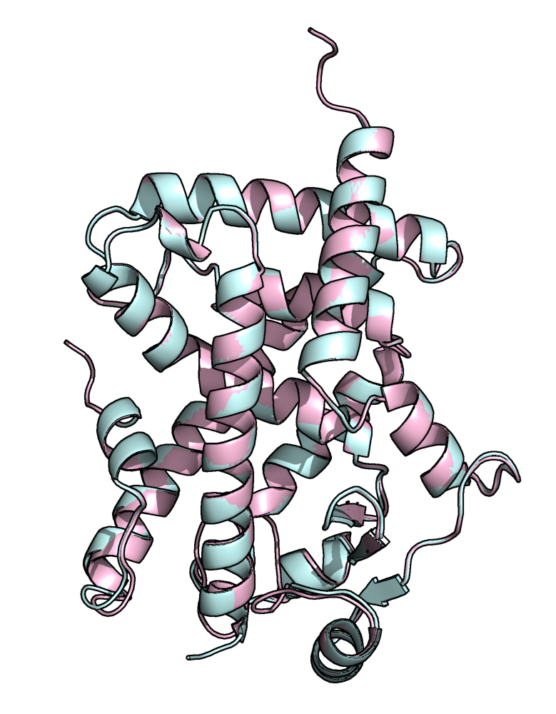{ width=45% }


The preparation of a valid **PIR alignment file** requires adherence to the syntax conventions expected by **MODELLER**, since this file constitutes the formal representation of the template–target relationship used during comparative modeling. Each entry begins with a **PIR-style header** in the form `>P1;identifier`, followed by a descriptor line that specifies the structural or sequence role of the entry. For the **template**, this descriptor typically begins with `structureX:` and includes the relevant structural reference, residue range, and chain identifier, whereas for the **target** it begins with `sequence:` and identifies the sequence to be modeled. Within the aligned sequences, residues absent from the experimental structure must be represented explicitly as **gap characters (`-`)**, allowing unresolved segments of the template to be distinguished from the continuous canonical sequence. When full-length reconstruction is not required for the docking objective, the alignment should be restricted to the **structurally and functionally relevant region** of the receptor, such as the **ligand-binding domain (LBD)** of **PPAR-γ**, rather than extending to flexible or poorly defined terminal regions. Each sequence entry must terminate with an asterisk (`*`), as required by the PIR specification. In this context, inspection of the original structural study is often useful for identifying which unresolved regions are biologically relevant and which correspond only to **flexible loops** or **termini** that need not be reconstructed for docking purposes. the original PDB article helps you decide which regions are functionally relevant.


Once **`seq_5YCP.ali`** is ready, run your **MODELLER** script (e.g., **`make_model.py`**) pointing to:

- `alnfile` = `seq_5YCP.ali`
- `knowns` = template identifier (e.g., `5YCP_receptor`)
- `sequence` = target identifier (e.g., `PPARG_P37231-2`)
- `n_models` = number of models to generate (you will later choose the best by DOPE/other scores)


In **AutoModel**, `n_models` is set via the index range:

```bash
a.starting_model = 1
a.ending_model   = 3    # generates three models.
```

**Run** from your working directory:

```bash
python make_modelo.py
```

The script will generate one or more **PDB models** for the receptor’s crystallized region. You can obtain typical outputs (filenames depend on sequence):


| Filename | molpdf | DOPE score | GA341 score |
|---|---:|---:|---:|
| `PPARG_P37231-2.B99990001.pdb` | 1173.57715 | -35933.17969 | 1.00000 |
| `PPARG_P37231-2.B99990002.pdb` | 1117.48389 | -36061.49219 | 1.00000 |
| `PPARG_P37231-2.B99990003.pdb` | 1189.37024 | -35883.63281 | 1.00000 |


This step outputs the specified number of models and their scores. Select the **top-scoring** one (e.g., by **DOPE**). 


You can also open the models in **PyMOL** and align them to the cleaned crystal structure to inspect **RMSD** and visualize differences in the **modeled regions**. In our case, we compared the modeled protein (**pink**) with the cleaned **5YCP** structure (**blue**) and obtained an **RMSD of 0.090 Å**, indicating excellent agreement. The main deviations occur in **loop regions**; notably, the previously missing loop was modeled toward the **orthosteric site**, which could interfere with docking. Keep this in mind when selecting structures. Once satisfied, choose the model for the next steps and proceed with receptor preparation for docking.

The numbering for amino acid should be homogolized with **UNIPROT** using **pdb-tools** as follows:

```bash
pdb_reres -204 PPARG_model.pdb > PPARG_model_reres204.pdb
```

<br>

### 2.2.4 Binding-Site Identification

Once the receptor model has been finalized, the next step is to identify structurally plausible ligand-binding pockets that can serve as candidates for docking. For this purpose, the receptor **PDB** file may be submitted to the [CavityPlus](http://www.pkumdl.cn:8000/cavityplus/#/computation) server. The server ranks cavities by **druggability score** and reports **volume**, **surface area**, **centroid coordinates**, and **lining residues** and reports geometric and physicochemical descriptors for each predicted pocket. These outputs typically include cavity ranking, **centroid coordinates**, **lining residues**, and quantitative descriptors such as **volume** and **surface area**.


Within the docking workflow, this information serves two related purposes. First, it supports the selection of the pocket to be targeted, particularly when multiple cavities are detected on the receptor surface. Second, it provides the spatial parameters required to define the docking search space, especially the coordinates used to position the center of the docking box. In practical terms, the most relevant information to retain from the cavity analysis includes the **pocket identifier**, the **centroid coordinates (x, y, z)**, the **residues lining the cavity**, and, when useful as additional context, the reported **volume** and **surface area**.


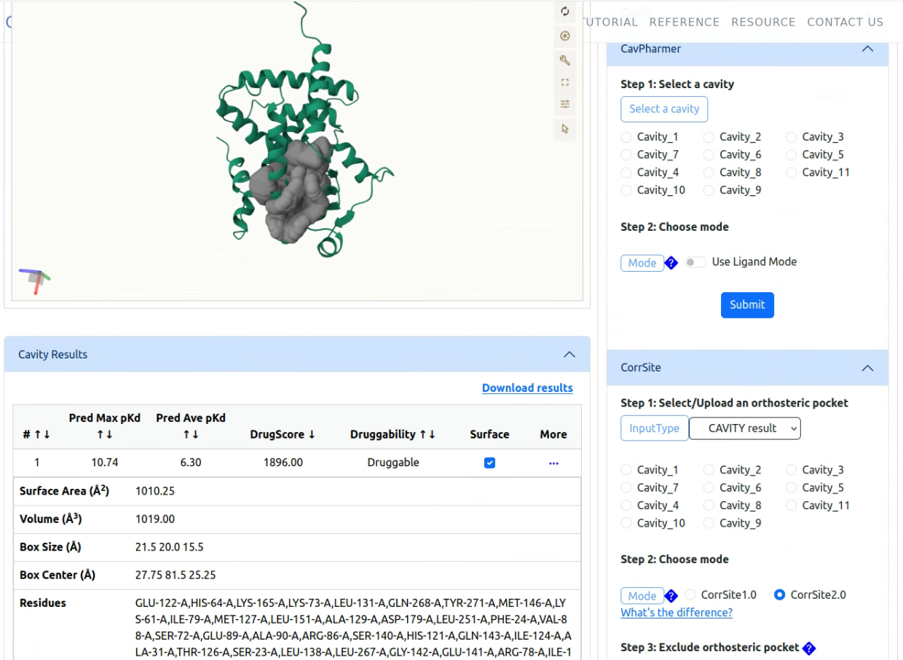{ width=75% }


Pocket selection should not rely exclusively on cavity ranking. Whenever structural, biochemical, or pharmacological evidence is available, the predicted cavity should be evaluated in the context of the known or expected **orthosteric binding region**, so that the defined docking box corresponds to a biologically relevant ligand-binding environment.

<br>

### 2.2.5 Docking Search Space (Grid Box)

Once the binding pocket has been selected, the docking search space must be defined so that the sampling procedure is restricted to the region of the receptor that is relevant for ligand recognition. In **AutoDock Vina**, this search space is specified by the **center coordinates** of the box and by its **dimensions** along the three Cartesian axes. The box center is typically assigned from the **centroid coordinates** of the selected cavity, whereas the box size is chosen to fully encompass the pocket and its immediate surroundings.

In practical terms, the box dimensions should be large enough to include the full binding cavity and permit reasonable ligand reorientation, while avoiding an unnecessarily large volume that would expand the conformational search beyond the region of interest. For this reason, the search space is commonly defined as the predicted pocket volume plus an additional margin sufficient to accommodate ligand motion within the site. An illustrative parameterization is shown below:

```bash
--center_x <x> --center_y <y> --center_z <z>
--size_x 21 --size_y 20 --size_z 16
```

For example:
```bash
--center_x 10.2 --center_y 14.7 --center_z 7.9
--size_x 21 --size_y 20 --size_z 16
```

When multiple receptor conformations or receptor states are analyzed in parallel, the same box center and dimensions should be retained only if the binding site geometry remains comparable across structures. Regardless of the final values selected, the center coordinates and box dimensions must be documented explicitly, since these parameters are required for computational reproducibility and for subsequent interpretation of docking poses.

> **Note:**  
> - Keep the box as tight as practical around the binding site to reduce false positives.
> - For multiple receptor states, keep **center/size** consistent unless pocket geometry differs significantly.
> - Document the final **center** and **size** you use; you will need them for reproducibility and for plotting/analysis later.


<br>


## 2.3 Docking Setup and Execution

Now we will need to finish our setup before performing the docking. Here we need to get the structure of the receptor in .pdbqt, as well as defining a docking box and other docking parameters. We will prepare the .pdbqt of the receptor and the docking box in one step using Chimera. We will use the modeled PPAR $\gamma$ (PPARG_model.pdb) and the rosiglitazone from the crystal (6MD4_ligand.pdb). Both structures will be opened in Chimera, then we will go to the "Tools" tab, then to the "Surface/Binding Analysis" tab, and finally select "AutoDock Vina". This will open a dialog box where we will need to define the output location and name (PPARG.pdbqt), select the structure corresponding to the receptor, and the one corresponding to the ligand. 


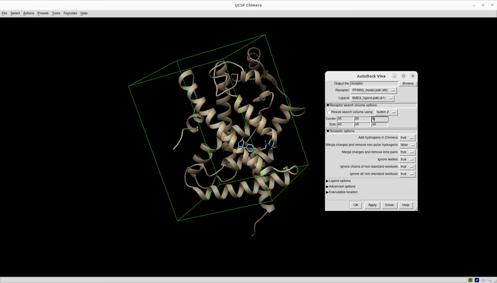{ width=70% }

Then, in the center and size boxes is where the dimensions of the box will be defined, in cases where we have no idea where to begin we can start at center 0,0,0 and size 20,20,20. Then we will need to resize and define the box according to our needs; if we are interested in interactions with a particular region of the receptor (e.g. orthosteric site) then the box should encompass that region, in cases where we do not know where the ligands can interact then we can build a box that encompasses the whole receptor. 


> **Note:**  
> Do not make the box too tight, leave some room for error as some ligands could sneakily fit when we are restraining.


After defining the right box, we will click OK. Here, Chimera will attempt to dock the selected ligand to the receptor, and preparing a .pdbqt file of both the ligand and receptor, and  also adds hydrogens. We will also see a .conf file that was generated, this will become the configuration for our docking, here we see our box dimensions and three more parameters. Exhaustiveness means how extensively the docking will be, the default if 8, but I like to use 100 for more precise calculations. Energy range is the maximum energy difference between the best pose and the rest of reported poses. Finally num of poses is how many poses will report, the default is 10, but they could be reduced. 

So, now we have our two **`*.pdbqt`** structures for the receptor and ligand, and our **`*.conf`** file, and we are ready to perform our first docking. 

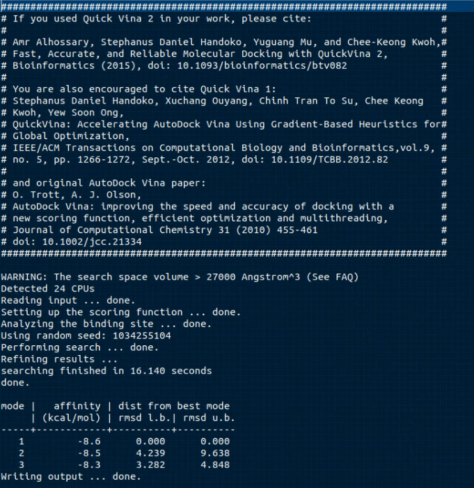{ width=65% }


<br>

### Perform the Docking

If everything else went well, then this should be the easiest part. To perform the docking we will use the following command: 

```bash  
../../qvina2.1 --receptor PPARG.pdbqt --ligand rgz.pdbqt --config pparg_dock.conf --out rgz_docked.pdbqt --num_modes 1 --log rzg.log
```

And _voilà_, there we have our docking. We can see on the terminal the docking binding energy in kcal/mol. 


<br>

## 2.4 Analysis of Results

We can open in Pymol the used structure and the output _docked.pdbqt file to see its best docking pose. We can also create some pretty nice figures with Pymol to showcase where the preffered pose of the ligand was on blind docking. To get the egenral figure of the blind docking we can open our receptor's **`*.pdbqt`** file and all the _docked.pdbqt ligands in Pymol, we can also include the surface of the calculated cavity to showcase if the best docking poses fit within this orthosteric site. In the following figure we see the receptor in blue, the docked molecules in orange and the calculated binding site in yellow. 


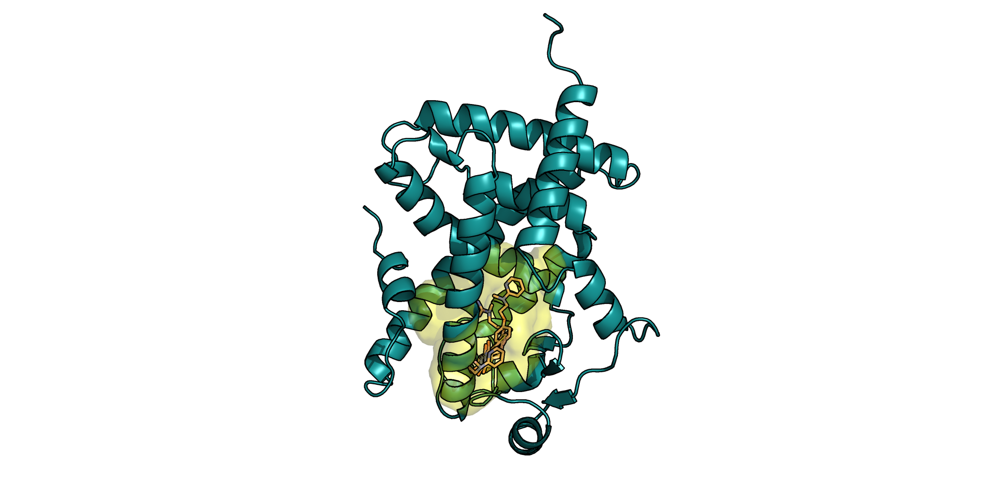{ width=50% }


To get the aestethic of this figure, I first changed the background to white, then changed the ray trace mode with this command:

```bash  
set ray_trace_mode, 1
```

then I set the ray trace gain to show the black outline with:

```bash  
set ray_trace_gain, 0.005
```

And I changed the presentation of the cavity to surface and changed its transparency to 0.5 with:

```bash  
set transparency, 0.5
```

If we want a more thorough analysis of the interactions we can save a **`*.pdb`** file with the receptor and the docked molecule, then open it in LigPlot+ to see the relevant residues and types of interactions. We will see the residues that interact with the molecule, with those red outlines indicating hydrophobic interactions, and the H-bonds will be indicated with green dashed lines.


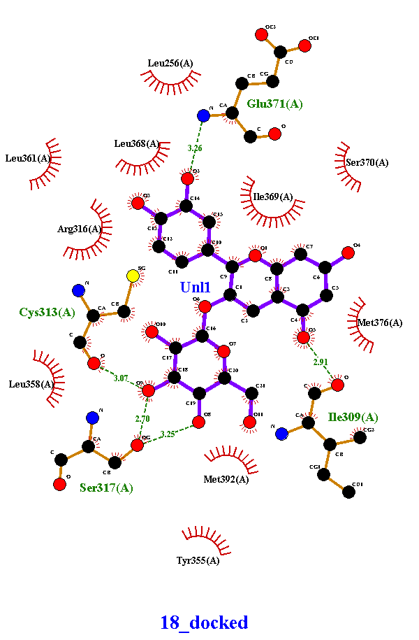{ width=50% }

<br>

> **Note:**  
> Be careful when dealing with the numbering of the receptor, we should usually use the canonical numbering, but when making new models the numbering can change and it will affect when we report our results and the numbers do not match the ones reported in the reference article from the crystal structure.

Now that we now the relevant interactions, we can make figures of the closeups of the molecule, showing the interacting residues. To achieve this, we can first change the transparency of the cartoon to avoid confusion when showcasing the molecule.

```bash  
set cartoon_transparency, 0.7
```

Then we can show the distances between the ligand and the protein within a cutoff distance in Å. You can choose any value, but the larger the distance the more interactions there will be and the figure can look saturated. In this command objects 1 and 2 should correspond to the name of the structures that we want to showcase.


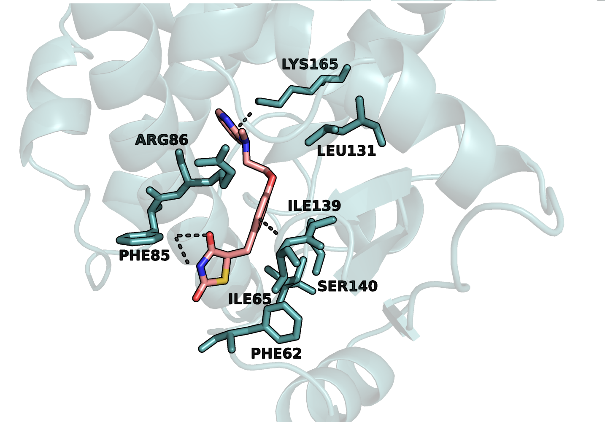{ width=60% }

```bash  
distances polar, object_1, object_2, 2.5
```

We can change the color of the interaction lines, and also show or hide the distance labels. Next we will need to select the interacting residues within that same cutoff distance with tha following command, where "LIG" is the name of our docked molecule:

```bash  
select br. all within 2.5 of LIG
```

Now we will have selected the relevant residues. Finally, we can show in licorice that selection, hide hydrogens and valences for clarity purposes, and add labels: 

```bash  
label n. CA and i. 235, "%s%s" % (resn,resi)
```

This will label the selected interacting residues in their alpha carbons, and include the residue name and number. Now we can find the best position for our final figure, and click on the left bottom corner in the pymol window and click where it says "3-button viewing", this should change the mode to "3-button editing". Now we can move the labels by doing ctrl+right click and positions the labels in a way that they are readable. Finally, we adjust our ray trace settings and export our figure that should look something like Figure 11.

We can also do repetitions of the same experiment, or get more docking poses to get a statistical analysis of the docking energies and poses. We can do the docking on other conformations of PPAR $\gamma$, and analyze the differences between the energies and interactions with those conformations. We can also weight these energies on another parameter to get the Ligand efficacy metric to make more practical sense of the results.

<br>

# PART 3: LigandHub

[LigandHub](https://nanobiostructuresrg.github.io/LigandHub/) is a prototype web-based platform for ligand preparation and docking output recovery. It converts molecular structures in SDF, PDB, MOL2, or SMILES format into PDBQT files and can recover docked ligand coordinates from PDBQT or DLG results into SDF format. Ligands can be processed individually or in batch through the Batch Ligand Preparation section using SMILES libraries. The batch workflow returns a ZIP archive containing prepared PDBQT ligands and a summary file. Large libraries should be split into smaller files before upload. The current version (v0.1.0) applies conservative upload and library-size limits shown in the interface when available.
The software utilizes RDKit (2025.9.2) for chemical perception and **Meeko** (0.7.1) for AutoDock-specific ligand preparation. 


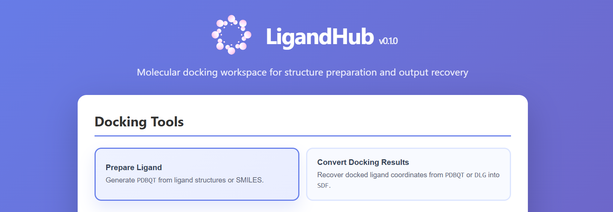{ width=70% }


## 3.1 Architecture  

**LigandHub** is implemented as a web-based backend service using FastAPI. The API exposes HTTP endpoints corresponding to the main platform workflows, including service monitoring, limit reporting, SMILES validation, ligand preparation, batch ligand processing, and docking-output recovery. Request inputs are provided through standard HTTP methods and form-data fields, and responses are returned as structured JSON metadata or downloadable molecular files depending on the workflow.

The public API consists of six endpoints, namely:  

- **GET /health** provides a minimal health-check response used to verify service availability. 
- **GET /limits** reports active upload, batch-processing, and output-generation limits configured for the deployment. 
- **POST /validate** accepts a SMILES string as form data and returns validation status, errors, warnings, and the submitted SMILES. 
- **POST /prepare_ligand** accepts a single molecular input file and returns a prepared ligand in PDBQT format. 
- **POST /prepare_ligand_batch** accepts a SMILES library and returns a ZIP archive containing generated PDBQT files and a structured summary. 
- **POST /convert_pdbqt_to_sdf** accepts supported docking-output files and returns reconstructed docked conformations in SDF format.


## 3.2 Functionalities

**LigandHub** as an integrated platform for ligand preparation and docking-output recovery supports several input formats, validation procedures, molecular preprocessing, ligand preparation workflows, batch processing, and docking-output recovery. 

### 3.2.1 Single-Ligand Input Formats

**LigandHub** accepts single-ligand inputs as either SMILES-based text files or structure-based molecular files. SMILES-based inputs are supported through .smi, .smiles, and .txt formats, whereas structure-based inputs are supported in SDF, PDB, and MOL2 formats. These inputs provide the molecular representations used for validation, preprocessing, and ligand preparation.

### 3.2.2 Batch Input Format

Batch ligand preparation uses SMILES-based library files in .smi, .smiles, or .txt format. The input is interpreted as a line-based molecular library, where each valid record contains a SMILES string followed by a ligand identifier. The expected format consists of a whitespace-separated SMILES field and ligand identifier field on each record line. Empty lines and comment lines are ignored during parsing. Malformed records that do not contain both a SMILES string and a ligand identifier are treated as invalid entries. The parsed ligand identifier is used for output naming and result tracking, while the SMILES field defines the molecular structure processed in the batch workflow.

### 3.2.3 SMILES Validation

Molecular structures that can be parsed are subjected to RDKit sanitization, which evaluates the internal chemical consistency of the molecule and identifies structural issues that would compromise downstream processing. Sanitization failures are treated as validation errors, as they indicate that ligand preparation cannot proceed reliably. Valence-related failures are handled explicitly. When RDKit raises a valence exception, the affected atom index is extracted when available. The corresponding atom is then used to construct a structured error containing the atom index, element symbol, observed valence, and, when defined, a typical maximum valence for the element. This approach provides chemically interpretable feedback rather than a generic parsing error. If the atom index cannot be determined, the original exception is returned as a validation error.

### 3.2.4 Molecular Preprocessing

Molecular preprocessing is initiated after input reception and, when applicable, validation. LigandHub loads molecular structures using RDKit according to the submitted file format. Structure-based inputs are accepted as SDF, MOL2, or PDB files, whereas SMILES-based inputs are accepted as .smi, .smiles, or plain text files. For SMILES-based single-ligand inputs, the first non-empty line is read and the first whitespace-separated token is interpreted as the SMILES string.

### 3.2.5 Hydrogen Addition and 3D Coordinate Generation

Hydrogen addition is performed as part of preprocessing because explicit hydrogens are required for reliable downstream PDBQT generation. RDKit is used to add hydrogen atoms to the molecular representation, ensuring consistency for subsequent geometry handling and docking-oriented export. For SMILES and other two-dimensional inputs, three-dimensional coordinates are generated prior to ligand preparation. RDKit embedding is used to construct an initial 3D conformer when spatial coordinates are not available. For input formats that already contain three-dimensional coordinates, the submitted geometry is preserved rather than replaced, while still allowing hydrogen addition and optional geometry optimization. This approach avoids unnecessary modification of externally provided structures while ensuring that coordinate-free inputs become suitable for docking preparation.

### 3.2.6 Energy Minimization

Energy minimization is an optional preprocessing step controlled by user-defined parameters. When enabled, molecular geometry is optimized with RDKit following hydrogen addition and coordinate generation or loading. The maximum number of minimization iterations is configurable and constrained by service-level limits. MMFF94 is used as the primary force field when molecular parameters can be assigned. If MMFF94 parameters are unavailable, UFF is used as a fallback. If neither force-field can be applied, preprocessing proceeds with the current geometry rather than discarding the molecule. The resulting structure is then forwarded to the ligand preparation stage for PDBQT generation.

## 3.3 Docking Outputs

**LigandHub** supports recovery of docked ligand coordinates from AutoDock-compatible docking output files. Accepted input formats include PDBQT and DLG. PDBQT files typically represent docked ligand poses generated by AutoDock Vina and related workflows, whereas DLG files correspond to docking log outputs produced by AutoDock-family tools. In both cases, the input is treated as a docking-result file rather than as an unprepared ligand structure. The recovery workflow converts docked ligand conformations into SDF format for downstream analysis, visualization, or storage. The recovered structures correspond directly to the coordinates encoded in the docking output and are not newly generated conformations.


<br>

---

### License
The content of this document itself is licensed under the terms and conditions of the [Creative Commons Attribution (CC BY 4.0) license](https://creativecommons.org/licenses/by/4.0/legalcode.en), and the underlying source code used to format and display that content is licensed under the [MIT license](https://github.com/NanoBiostructuresRG/AutodockTutorial/blob/main/LICENSE). See the LICENSE files for full details.

### Attribution
If you use or adapt this material, please provide appropriate credit to the original authors, [ACM](https://orcid.org/0000-0002-7619-8880) and [FFCT](https://orcid.org/0000-0003-2375-131X), as well as to the repository: [https://github.com/NanoBiostructuresRG](https://github.com/NanoBiostructuresRG).
